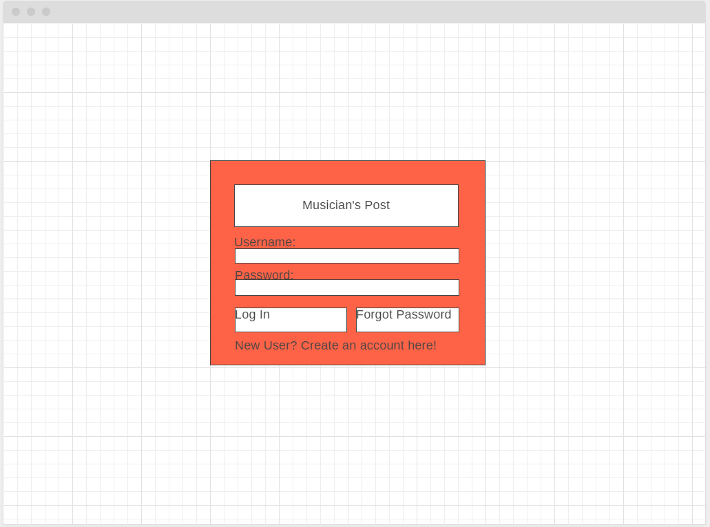
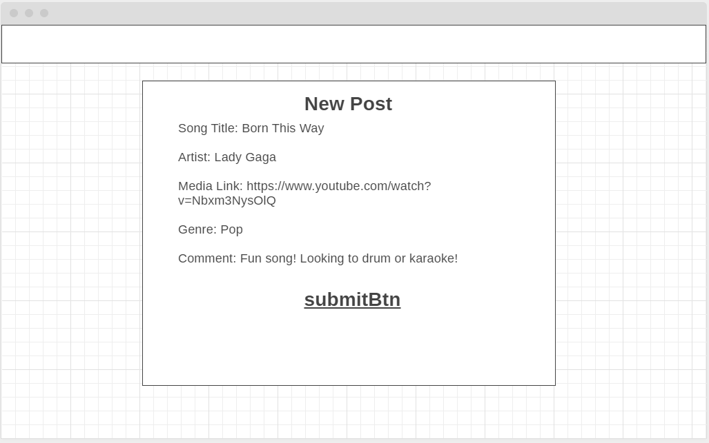
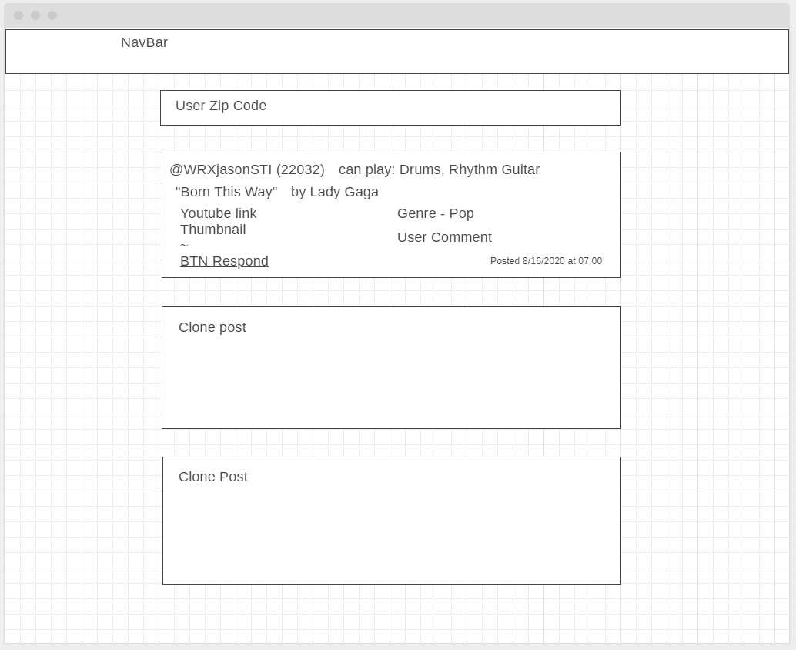
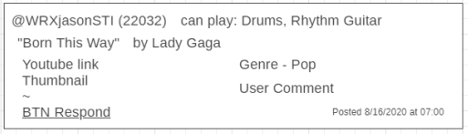
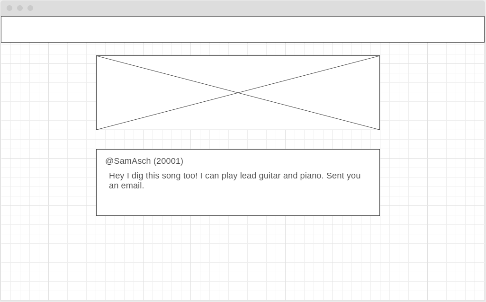

# musiciansPost

Database Project 2 for GWU Coding Bootcamp  
  
  
  
  
  

## License
  
MIT License 

## Table of Contents

* [Installation](#Installation)  
* [Usage](#Usage)  
* [License](#License)  
* [Contributing](#Contributing)  
* [Tests](#Contributing)  
* [Contact](#Contact)  

## Installation
```bash
None. Click link to deployed website. 
```
## Usage
```bash
Sign up for an account and start viewing posts 
```
## Contributing

Jason Sam Brandon S 

## Tests

testing to be done as project moves along 

## Contact
For any questions and suggestions, please feel free to contact us here:
* GitHub: WRXjasonSTI 
* Email: jasoncruz_rocks@yahoo.com 

##
MIT License 
Copyright WRXjasonSTI longhike bperez94
    